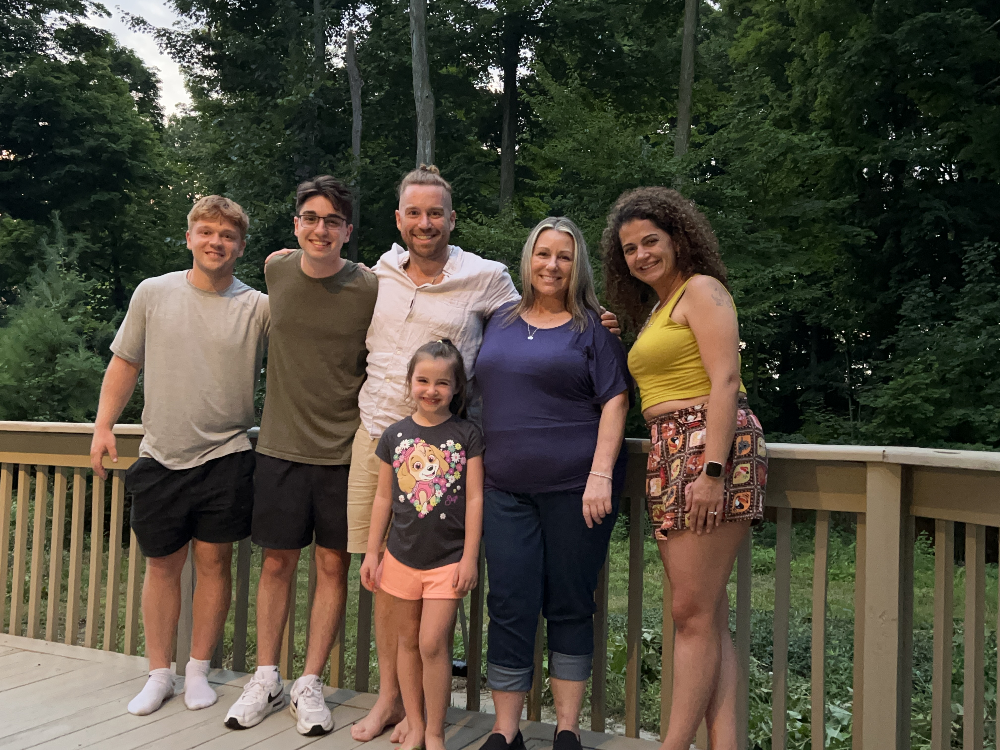

# Jill Piedmont Derleth

## Insurance to help you and your family find certainty

I chose to help people find insurance for a living because I know what a huge
difference it is to have good insurance. Without insurance, one bad event can
knock us down for years. With insurance, such issues might be just as hard to
deal with initially, but insurance can provide the means not just to survive,
but thrive following a major or catastrophic loss.

In time I will provide more details about me, my thoughts and advice on
navigating the insurance industry, and and more on this new site.

For now please enjoy this photo of my three sons, daughter in law, and
grand-daughter!

Please don't hesitate to get in touch with me directly if you
think I can help you on your journey to great insurance that reduces stress,
not increase it.

Call or email today if I can be of service to and your family as well.

  <i title='Phone' class='fa-solid fa-phone'></i>
    
    <a href="tel:+15855586919">(585) 558-6919</a> |
  <i title='Email' class='fa-solid fa-envelope'>
   
   </i> [jillderlethinsurance@gmail.com](mailto:jillderlethinsurance@gmail.com)

 

{width=500px}
